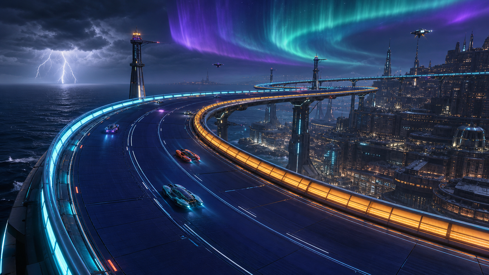
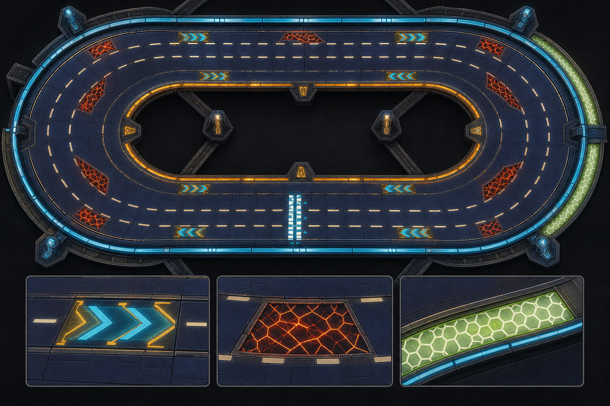
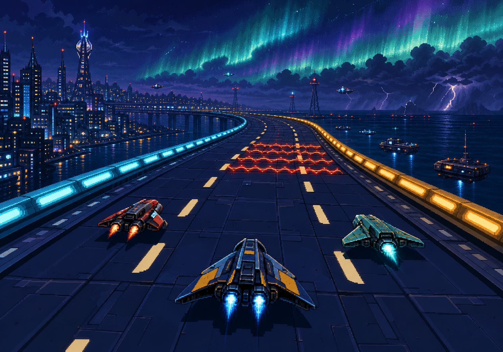

# AURORA CAUSEWAY

## Track 01 Creative And Race Design Brief

**Status:** Phase 2 visual-direction target  
**Role:** First official Velocity-16 course  
**Course fantasy:** A high-altitude energy causeway suspended above a storm-lit coastal megacity  
**Design promise:** A vibrant living world wrapped around a fast, readable, multiplayer-safe opening circuit

## North Star

Aurora Causeway is the moment Velocity-16 stops looking like a mechanics test and starts feeling like a place.

The circuit is part race venue, part power infrastructure. It catches charged aurora plasma from the upper atmosphere and carries it across the bay into the city below. Racers skim over a dark composite road while energy moves through the walls, maintenance drones patrol the outer structures, distant transit lines cross the skyline, storm cells pulse over the ocean, and a luminous aurora ribbon bends toward the horizon.

The spectacle belongs around the racing line. The surface, walls, hazards, and boost language remain graphic and immediately readable at 320x224. Background motion should create life without becoming steering information.

## Experience Goals

1. **Immediate confidence**
   - The first sector is wide, clean, and fast.
   - Players understand the wall colors and lane grammar before encountering danger.
   - The opening boost is optional and forgiving.

2. **A living destination**
   - The skyline changes by sector.
   - Energy pulses travel along the causeway.
   - Distant traffic, maintenance craft, beacon lights, storm flashes, and aurora motion create layered activity.
   - No decorative motion crosses the player's usable road silhouette.

3. **Readable multiplayer racing**
   - Normal racing space supports three distinct lines through every major decision.
   - Hazards create choices rather than hard single-file funnels.
   - Recharge is placed off the fastest line so damaged racers can recover without blocking the pack.
   - Boost pads do not fire ships directly into an unavoidable wall or hazard.

4. **A fair first official course**
   - Sector difficulty builds across the lap.
   - Every punishment is preceded by strong surface and wall telegraphing.
   - The final approach is fast and dramatic, not a surprise trap.

## Visual Hierarchy

### Priority 1: Driveable Surface

The player must always be able to identify:

- Both collision edges
- Forward direction
- Neutral pavement
- Boost, hazard, and recharge surfaces
- Open lanes around other racers

The pavement is midnight indigo with broad value separation from the void. Fine texture is allowed, but it must remain darker and lower-contrast than gameplay markings.

### Priority 2: Near-Track Identity

Near-track elements create the course identity:

- Cold cyan outer safety rail
- Hot amber inner pressure rail
- Ivory directional lane dashes
- Large sector-number pylons
- Pulsing energy conduits below the rail caps
- Sparse overhead gates at safe sightline moments

Near-track animation may pulse along the direction of travel, but must not imitate hazard flashing.

### Priority 3: World Staging

The background supplies life and scale:

- A terraced coastal megacity below the inside of the circuit
- Black ocean and storm fronts beyond the outside rail
- Distant maglev traffic
- Slow maintenance drones
- Vertical aviation beacons
- Lightning inside far clouds
- A cyan, violet, and sea-green aurora ribbon

Background elements should use softer contrast, slower motion, and smaller silhouettes than track signs.

## Palette And Material Language

| Function | Color family | Material / behavior |
| --- | --- | --- |
| Neutral road | Midnight indigo, blue-black | Matte ceramic composite with subtle segmented panels |
| Outer wall | Cold cyan | Transparent energy edge with white beacon nodes |
| Inner wall | Hot amber | Dense conductive barrier with orange pulse bands |
| Direction marks | Warm ivory | Painted luminous ceramic, steady light |
| Boost | Electric cyan plus gold | Forward chevrons with a rapid directional chase |
| Hazard | Vermilion plus warning red | Broken electrical lattice with irregular contained arcs |
| Recharge | Lime-white plus soft mint | Calm continuous strip with upward flowing cells |
| Start / finish | White, cyan, and a restrained violet accent | High-contrast gate and broad road bars |
| Background city | Indigo, violet, dim aqua | Dense but lower-contrast light clusters |
| Aurora | Cyan, sea-green, violet | Wide soft ribbon, slow parallax motion |

Color cannot be the only gameplay signal. Every zone also receives a unique pattern:

- Boost: forward arrowheads
- Hazard: fractured diagonal lattice
- Recharge: continuous cells flowing toward the ship

## Course Geometry

The first implementation remains within the proven analytical-oval contract. This protects Phase 1 collision, checkpoint, respawn, wrong-way, minimap, texture, and rail behavior while we establish the visual production pipeline.

Recommended starting dimensions:

- Texture center: 1024, 1024
- Major radius: approximately 820 world units
- Minor radius: approximately 470 world units
- Inner track distance: approximately 0.78
- Outer track distance: approximately 1.12
- Three laps
- Eight checkpoint gates

This creates long north and south speed runs, compressed east and west turns, and a narrower official-course width than Feel Lab 02. Exact values remain tuning targets until driven.

### Multiplayer Width Rule

At every normal racing decision, the clean road must visibly support at least three practical lines:

- Inside attack line
- Center momentum line
- Outside recovery or overtake line

A hazard may remove one line temporarily. It must not remove two lines unless the remaining opening is deliberately wide, clearly previewed, and safe for side-by-side entry.

## Clockwise Lap Flow

### Sector 1 — Launch Crown

**Location:** North straight and northeast approach  
**Purpose:** Confidence, acceleration, visual reveal

- Broad starting grid with strong white/cyan bars
- City basin visible beyond the inside rail
- Optional center-right boost chevrons after the pack has space to spread
- No hazard before the first boost
- Tall sector pylon introduces the cyan outer and amber inner wall language

**Life staging:** Starting gantry light sweep, distant transit crossing, slow energy pulse leaving the line with the racers.

### Sector 2 — Glass Hook

**Location:** East compression curve  
**Purpose:** First meaningful corner and passing test

- Clean three-line entry
- Amber inner wall intensifies in brightness as curvature increases
- Outside line stays generous for side-by-side racing
- Short ivory braking bars before the tightest visual point
- No full-width scenery gate at corner entry

**Life staging:** Ocean-side storm wall, far lightning, maintenance drone below the outer rail.

### Sector 3 — Storm Cut

**Location:** Southeast exit into the south run  
**Purpose:** First hazard choice

- Two staggered electrical fracture fields
- First hazard occupies outer-to-center space
- Second hazard occupies inside-to-center space farther ahead
- The offset creates a readable S-choice without forcing single file
- A skilled center transition is fastest; committed inside or outside routes remain viable

**Life staging:** Energy collector towers drawing thin arcs from the cloud layer. These arcs remain above the horizon or outside the road silhouette.

### Sector 4 — Mercy Rail

**Location:** South straight  
**Purpose:** Recovery, pack reorganization, speed

- Recharge strip along the outside third of the road
- Neutral center remains open
- Inside line is shortest and fastest
- Recharge begins after the Storm Cut exit so damaged racers do not abruptly cross the pack
- Strip ends before the west braking zone

**Life staging:** Closest view of the city below, animated window bands, two distant maglev lines moving in opposite directions.

### Sector 5 — Needle Gate

**Location:** West compression curve  
**Purpose:** Mastery choice and late-lap tension

- Safe outside arc with no zone
- Stable center arc with a modest hazard exposure
- Risky inner boost strip placed after corner commitment
- Boost direction follows the curve exit and never points toward the outer wall
- Sufficient clear runoff follows the pad for ship-to-ship contact recovery

**Life staging:** A pair of tall causeway spines form the visual gate, but sit outside the collision silhouette and preserve horizon readability.

### Sector 6 — Aurora Sweep

**Location:** Northwest exit back to the line  
**Purpose:** Emotional payoff and clean finish

- Wide, fast final sweep
- Strong forward lane rhythm
- No new hazard after the player sees the finish gantry
- Outer cyan rail performs a directional light chase toward the line
- Aurora ribbon frames the skyline without touching the track edge

**Life staging:** The aurora reaches its brightest composition here; a distant launch plume or orbital elevator light provides a slow vertical counter-motion.

## Signage System

Signage uses large shapes and minimal text because the internal view is 320x224.

- Sector identifiers: `S1` through `S6`
- Boost sign: stacked forward arrowheads
- Hazard sign: fractured diamond
- Recharge sign: open cell / battery rail glyph
- Direction sign: one large ivory chevron, never dense repeated arrows
- Start / finish: `AURORA CAUSEWAY` may appear on the title and gantry, but road-critical signs should rely on symbols

No fictional advertisements are needed for Track 01. The course's infrastructure is its identity.

## Animation Budget

The scene should feel active through layered low-cost systems:

1. Slow sky gradient and aurora phase shift
2. Sparse city light flicker
3. Distant one-pixel traffic movement
4. Rail pulse traveling with race direction
5. Zone-specific animation
6. Occasional far lightning with no full-screen flash

Only boost and hazard zones may use fast animation near the road. Recharge remains calm. Background motion must never match the speed or cadence of boost chevrons.

## Multiplayer And AI Safety Rules

- Keep the starting straight hazard-free.
- Leave at least one neutral lane beside every boost pad.
- Do not place hazards immediately after blind curvature.
- Avoid symmetric hazards that cause the whole pack to converge on one gap.
- Offset decision points so racers have time to separate, choose, and rejoin.
- Place recharge off-line and long enough that a damaged racer does not need to stop.
- Preserve a clean road buffer after boosts for collision recovery.
- Keep checkpoint gates wider than the expected pack spread.
- Validate AI steering on the official track only after the solo line is stable.
- When AI returns, give it lane targets rather than only checkpoint-center targets before considering the course race-ready.

## Mood Board Deliverables

1. **Environment key art**
   - Establish the living coastal megacity, suspended causeway, storm ocean, and aurora identity.
2. **Top-down surface language**
   - Prove road palette, lane hierarchy, rail colors, boost pattern, hazard pattern, recharge strip, and multiplayer width.
3. **Gameplay framing study**
   - Test what survives a retro 320x224 racing composition: road readability first, world spectacle second.

These are direction-setting references, not final production textures.

## Approved Visual Study Set

### Environment And World Staging

Carry forward:

- The ocean-versus-city split gives the inner and outer sides distinct identities.
- Cyan outer and amber inner rails remain readable across a large curve.
- Sparse collector pylons, distant traffic, and maintenance craft make the course feel active without occupying the road.
- The aurora creates a memorable ceiling and finish-sector composition.

Do not copy literally:

- Final in-game architecture must be simplified for the 320x224 renderer.
- The skyline and lightning need lower contrast than the reference once reduced to gameplay scale.

### Surface And Lane Language

Carry forward:

- Dark segmented pavement gives every functional marking room to read.
- Ivory lane dashes provide stable navigation without competing with zones.
- Boost, hazard, and recharge each have a distinct color and pattern.
- The recharge strip reads naturally as a slower outside service lane.

Do not copy literally:

- The concept contains more hazards and boost pads than the production lap should.
- Production hazards will use the sector plan's staggered partial-lane placements.
- The concept's capsule silhouette is a visual-language study, not a commitment to new collision geometry.

### Gameplay Readability Target

Carry forward:

- The lower two-thirds road / upper-third world composition suits the current camera.
- Three racers can hold separate lines without losing the next decision.
- Large rail blocks survive pixel reduction better than delicate continuous glow.
- Background life works when its contrast and motion are softer than the road.

Do not copy literally:

- The illustrated center hazard is too wide for pack racing.
- Ships, surface detail, and background density must be reduced to the actual rendering budget.
- Lightning must remain distant and must never produce a steering-obscuring full-screen flash.

## Implementation Order

1. Approve the course brief and mood-board direction.
2. Replace the placeholder official track name and dimensions.
3. Add track-owned visual theme data rather than hard-coding Aurora colors globally.
4. Author sector zones and validate driveability on the procedural surface.
5. Make guide rail colors and post rhythms track-configurable.
6. Add Aurora-specific surface bands and signage.
7. Add restrained skyline and sky staging behind feature-safe interfaces.
8. Test solo, then enable AI and tune multiplayer lane behavior.
9. Preserve Feel Lab 02 as the mechanics regression course.

## Acceptance Criteria

Aurora Causeway is ready for the next production milestone when:

- The player can identify both walls and forward direction in every sector.
- A clean lap is possible without memorizing hazard positions.
- Every major decision has at least two safe routes and normally three practical racing lines.
- Boost pads create speed without causing unavoidable collisions.
- Recharge is useful without being the fastest route.
- The environment looks alive while the road remains the highest-priority readable element.
- Feel Lab 02 still behaves exactly as before.
- The production build passes.
